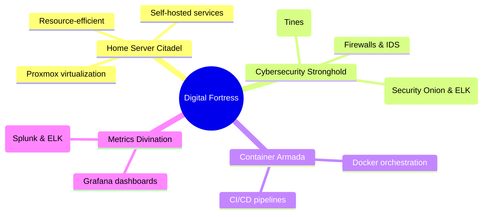

# Alaa Eddine Ayedi | Digital Fortress Architect

<div align="center">


</div>

```ascii
 _______________________________________
< Seeking Network Security Internship! >
 ---------------------------------------
        \   ^__^
         \  (oo)\_______
            (__)\       )\/\
                ||----w |
                ||     ||
```

## 🛡️ Skill Arsenal

<table>
  <tr>
    <td></td>
    <td></td>
    <td></td>
  </tr>
</table>

## 🔧 Tech Stack


## 🏆 Key Projects



## 🧪 Current Experiments

- 🕵️ Advanced threat hunting
- 🤖 AI in cybersecurity
- ☁️ Cloud-native security
- 🔐 Zero-trust architecture

## 🌟 Availability Beacon

```python
def internship_status():
    available_from = datetime(2025, 2, 1)
    location = "Anywhere in the world"
    passion = "Network Security"
    
    return f"Ready to secure networks from {available_from.strftime('%B %Y')} | Open to {location} | Passionate about {passion}"

print(internship_status())
```

## 🌐 Connect

[](https://linkedin.com/in/alaaeddineayedi/)
[](https://medium.com/@alaayedi090)
