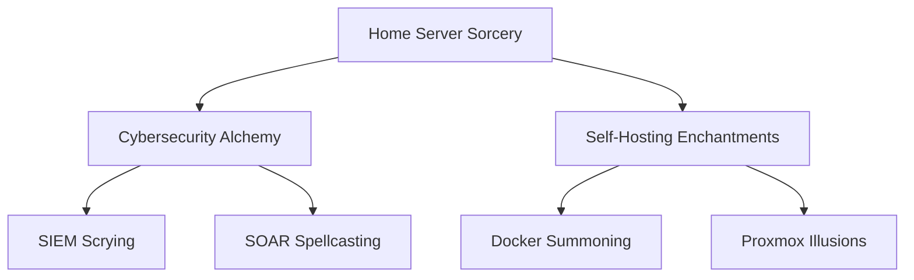

# 👨‍💻 Alaa Eddine Ayedi | Digital Fortress Architect

```ascii
 _____________________
< Welcome to my realm >
 ---------------------
        \   ^__^
         \  (oo)\_______
            (__)\       )\/\
                ||----w |
                ||     ||
```

## 🏰 Fortifying the Digital Kingdom

Greetings, fellow tech enthusiasts! Step into my digital realm where bits are fortified, packets are scrutinized, and servers hum with the sweet sound of efficiency. I'm on a quest to build the ultimate home lab, defend against cyber dragons, and optimize every last byte.

### 🛡️ Arsenal of Digital Wizardry



### 🔮 Magical Artifacts


## 🏆 Legendary Quests

1. **🏠 Home Server Citadel**
   - Crafting a resource-efficient fortress of self-hosted services
   - Summoning and taming virtual machines with Proxmox sorcery

2. **🛡️ Cybersecurity Stronghold**
   - Erecting impenetrable firewalls and vigilant intrusion detection systems
   - Scrying the network with SIEM crystal balls (Security Onion & ELK Stack)
   - Automating defenses with SOAR battle strategies (Tines)

3. **🐳 Container Armada**
   - Orchestrating a fleet of Docker vessels for swift deployment
   - Charting CI/CD routes for smooth sailing of services

4. **📊 Metrics Divination**
   - Conjuring Grafana dashboards to foresee network anomalies
   - Diving into the depths of logs with Splunk and ELK Stack

## 🧪 Experimental Brews

- 🕵️ Advanced threat hunting potions
- 🤖 AI-powered security familiars
- ☁️ Cloud-native protection spells
- 🔐 Zero-trust architecture runes

## 📜 Scrolls of Wisdom

> "In the realm of bits and bytes, vigilance is our shield, and knowledge our sword." - Digital Sage Alaa

## 🌌 Interdimensional Portals

[](https://linkedin.com/in/alaaeddineayedi/)
[](https://medium.com/@alaayedi090)

---

<div align="center">


</div>

```ascii
 ___________
< EOF >
 -----------
        \   ^__^
         \  (@@)\_______
            (__)\       )\/\
             U  ||----w |
                ||     ||
```
