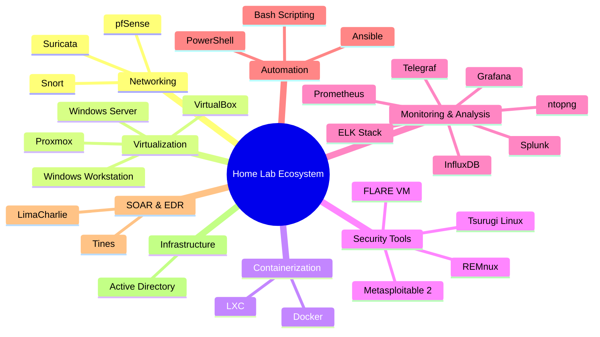

<h1 align="center">Alaa Eddine Ayedi | Home Lab Architect & Cybersecurity Enthusiast</h1>

<p align="center">
  
</p>

<p align="center">
  
</p>

## Arsenal of Digital Exploration



## Core Interests & Skills

- **Home Lab Architecture**: Designing and implementing comprehensive home server setups
- **Service Deployment**: Experimenting with various self-hosted services and applications
- **Virtualization & Containerization**: Mastering VM and container technologies for efficient resource utilization
- **Network Security**: Implementing and testing various security tools and configurations
- **Infrastructure Automation**: Crafting scripts and utilizing tools for streamlined management
- **Continuous Learning**: Staying updated with the latest in cybersecurity through blogs and documentation
- **Open Source Contribution**: Actively participating in and contributing to open-source projects
- **Troubleshooting & Optimization**: Solving complex issues and fine-tuning system performance

## Tech Stack Showcase


## Current Operations

- Implementing zero-trust architecture in a multi-VLAN home network environment
- Exploring machine learning integration with SIEM for advanced threat detection
- Developing custom dashboards for comprehensive home lab metrics visualization
- Automating routine tasks and deployments using Ansible and PowerShell

## Mission Availability

```python
def mission_status():
    expertise = "Home Lab & Network Security"
    mission_start = "February 2025"
    location = "Global"
    objective = "Innovate in Cybersecurity"
    
    return f"Specialist in {expertise}, ready for deployment from {mission_start}. \nMission parameters: Location - {location} | Objective - {objective}"

print(mission_status())
```

## Secure Communication Channels

[](https://linkedin.com/in/alaaeddineayedi/)
[](https://medium.com/@alaayedi090)

<p align="center">
  
</p>

<p align="center">
  
</p>
