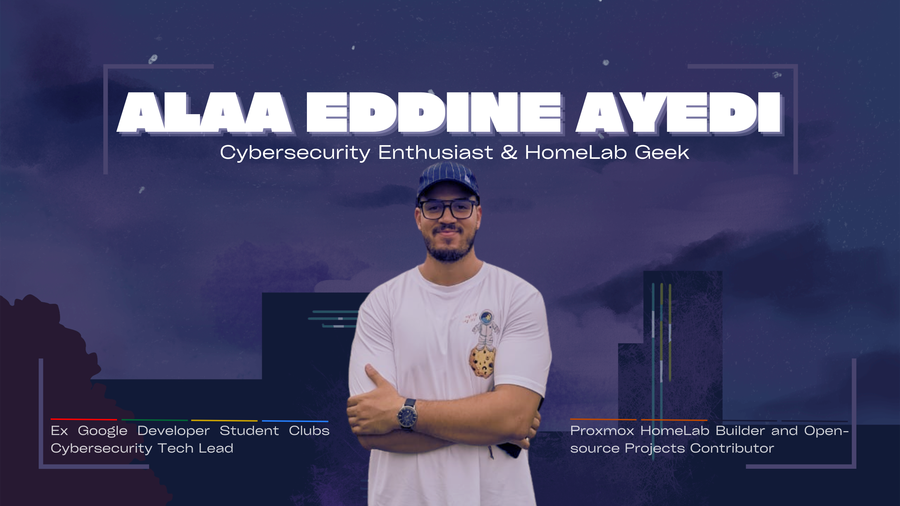

# Greetings, Fellow Digital Explorers!

### 👋 Hello, Cyber World!

I'm Alaa, a passionate Networks and Telecommunications MEng Student, diving deep into the realms of cybersecurity and network infrastructure. My journey is fueled by a love for building secure, efficient systems and a curiosity for all things tech.

### What I'm Into

- 🔒 Cybersecurity
- 🌐 Network Security
- 🏠 Homelabbing
- 🤖 Automation
- 💻 Virtualization

### Currently Seeking

> **Actively looking for a Network Security Internship starting February 2025**

I'm eager to apply my knowledge in a real-world setting and contribute to meaningful projects in cybersecurity.

### Work Experience (Internships)

- Network Security Engineer Intern @Spark-it | Summer 2024 (2 months)
- Cybersecurity Tech Lead @Google Developer Student Clubs (GDSC ENET'Com) | 2023-2024
- Space Communication Department Lead and Finance Manager @Tunisian Space Association (TUNSA ENET'Com) | 2023-2024
- Research & Development Intern @TechInventors TN | Summer 2023 (1 month)
- Automotive Industry Intern @Primatec Engineering | 2022 (5 months)
- Machine Learning Intern @Djagora Fablab | Summer 2021 (1 month)
  
### Learning Journey

- Building and securing home lab environments
- Automating network configurations and deployments
- Exploring virtualization technologies
- Continuously improving my cybersecurity skills

### 🤝 Let's Connect!

I'm always excited to connect with fellow tech enthusiasts, students, and professionals. Feel free to reach out for discussions, collaborations, or just to geek out about cybersecurity!

---

  

