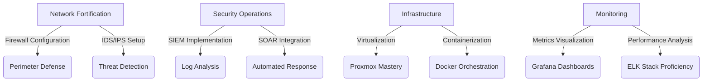

<h1 align="center">Alaa Eddine Ayedi | Digital Sentinel</h1>

<p align="center">
  
</p>

<p align="center">
  
</p>

## Arsenal of Digital Defenses



## Core Competencies

- **Network Security**: Architecting robust defense systems
- **Threat Intelligence**: Analyzing and mitigating cyber threats
- **Infrastructure Management**: Optimizing server and network performance
- **Automation**: Streamlining security operations with code

## Tech Stack


## Current Operations

- Implementing zero-trust architecture in home lab environment
- Developing machine learning models for anomaly detection
- Exploring offensive security techniques to enhance defensive strategies
- Optimizing network traffic analysis with custom-built tools

## Mission Availability

```python
def mission_status():
    clearance_level = "Top Secret"
    mission_start = "February 2025"
    location = "Global"
    objective = "Secure Digital Frontiers"
    
    return f"Operative armed with {clearance_level} skills, ready for deployment from {mission_start}. \nMission parameters: Location - {location} | Objective - {objective}"

print(mission_status())
```

## Secure Communication Channels

[](https://linkedin.com/in/alaaeddineayedi/)
[](https://medium.com/@alaayedi090)

<p align="center">
  
</p>

<p align="center">
  
</p>
